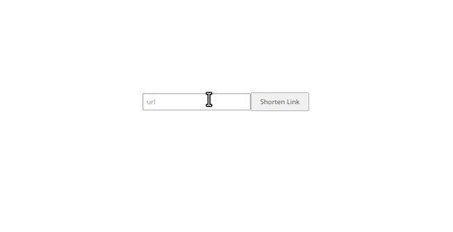

# Shorten Url 

## Description

A website shortening any url is developed in this project. If shortened url is opened in a browser, it is redirected to original url. Also, it is possible to check visiting times of each link.

## Built with

- Ruby 2.6.5
- Ruby on Rails v6.1.3.1
- Stimulus
- Capybara
- Rspec
- Git

## Setup

- Clone this repository
- Open terminal
- Change directory by using `cd Chunin-Exam/`
- Run `bundle install`
- Run `rails db:create`
- Run `rails db:migrate`
- Open rails server by using `rails s`
- Open browser and go to http://localhost:3000

## Test app

- Follow steps given in Setup part
- Install Chrome from [main page of Chrome](https://www.google.com/chrome/) or [terminal](https://linuxize.com/post/how-to-install-google-chrome-web-browser-on-ubuntu-18-04/)
- Run `rails db:test:prepare` and `RAILS_ENV=test rails db:migrate` on your terminal
- Run `rspec`

## Authors

Reach out to me at one of the following places!

👤 **Hasan Özovalı**

- Website: [ozovalihasan.com](https://www.ozovalihasan.com/)
- LinkedIn: [Hasan Özovalı](https://www.linkedin.com/in/hasan-ozovali/)
- Github: [@ozovalihasan](https://github.com/ozovalihasan)
- Twitter: [@ozovalihasan](https://twitter.com/ozovalihasan)
- Mail: [ozovalihasan@gmail.com](mailto:ozovalihasan@gmail.com)
## Contributing 🤝

Contributions, issues, and feature requests are welcome!

## Show your support

Give a ⭐️ if you like this project!

## License

- **[MIT license](http://opensource.org/licenses/mit-license.php)**
